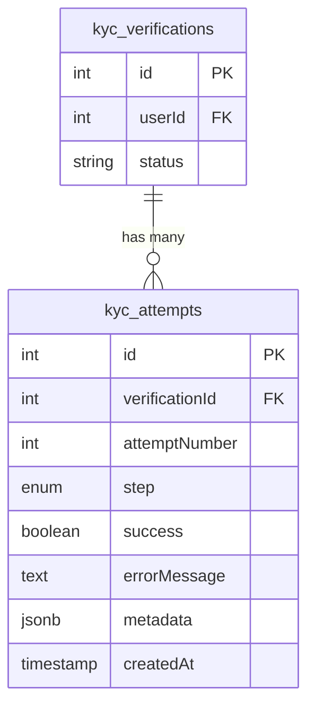

# Migración: kyc_attempts

## Descripción

Esta migración crea la tabla `kyc_attempts` que registra cada intento de verificación y sus errores para auditoría y análisis de problemas en el proceso KYC.

## Requisitos

Valida los requisitos 18.1-18.10 del documento de requisitos del sistema KYC.

## Estructura de la Tabla

### Campos

| Campo | Tipo | Nullable | Default | Descripción |
|-------|------|----------|---------|-------------|
| `id` | INTEGER | NO | AUTO | ID único del intento (Primary Key) |
| `verificationId` | INTEGER | NO | - | ID de la verificación asociada (FK a kyc_verifications) |
| `attemptNumber` | INTEGER | NO | - | Número de intento secuencial |
| `step` | ENUM | NO | - | Paso del proceso de verificación |
| `success` | BOOLEAN | NO | false | Indica si el intento fue exitoso |
| `errorMessage` | TEXT | YES | - | Mensaje de error si el intento falló |
| `metadata` | JSONB | NO | {} | Información adicional del intento |
| `createdAt` | TIMESTAMP | NO | NOW() | Fecha y hora del intento |

### ENUM: step

La tabla utiliza un tipo ENUM `enum_kyc_attempts_step` con los siguientes valores:

1. `document_capture` - Captura de documentos de identidad
2. `selfie` - Captura de selfie
3. `liveness` - Detección de vida mediante video
4. `ocr` - Extracción de datos con OCR
5. `face_match` - Comparación facial
6. `document_validation` - Validación de autenticidad del documento
7. `manual_review` - Revisión manual por operador

### Índices

1. **kyc_attempts_pkey** - Primary key en `id`
2. **kyc_attempts_verification_id_idx** - Índice en `verificationId` para búsquedas rápidas por verificación
3. **kyc_attempts_step_idx** - Índice en `step` para filtrar por paso del proceso
4. **kyc_attempts_created_at_idx** - Índice en `createdAt` para ordenamiento temporal

### Foreign Keys

- **verificationId** → `kyc_verifications(id)`
  - ON DELETE CASCADE: Si se elimina la verificación, se eliminan todos sus intentos
  - ON UPDATE CASCADE: Si se actualiza el ID de la verificación, se actualizan las referencias

## Características Especiales

### Sin updatedAt

A diferencia de otras tablas, `kyc_attempts` **NO incluye** el campo `updatedAt`. Esto es intencional porque:
- Los intentos son registros inmutables de auditoría
- Una vez creados, no deben modificarse
- Solo se necesita `createdAt` para registrar cuándo ocurrió el intento

### Metadata JSONB

El campo `metadata` permite almacenar información adicional específica de cada paso:

```json
{
  "ip_address": "192.168.1.1",
  "user_agent": "Mozilla/5.0...",
  "processing_time_ms": 1234,
  "library_used": "face-api.js",
  "confidence_scores": {
    "face_detection": 0.95,
    "face_match": 0.87
  }
}
```

## Uso

### Aplicar Migración

```bash
npx ts-node src/scripts/run-kyc-attempts-migration.ts up
```

### Revertir Migración

```bash
npx ts-node src/scripts/run-kyc-attempts-migration.ts down
```

### Verificar Tabla

```bash
npx ts-node src/scripts/verify-kyc-attempts-table.ts
```

## Ejemplos de Uso

### Registrar intento exitoso

```typescript
await KYCAttempt.create({
  verificationId: 123,
  attemptNumber: 1,
  step: 'face_match',
  success: true,
  metadata: {
    faceMatchScore: 87.5,
    processingTimeMs: 1234
  }
});
```

### Registrar intento fallido

```typescript
await KYCAttempt.create({
  verificationId: 123,
  attemptNumber: 2,
  step: 'ocr',
  success: false,
  errorMessage: 'No se pudo extraer el número de cédula',
  metadata: {
    ocrConfidence: 0.45,
    imageQuality: 'low'
  }
});
```

### Consultar intentos de una verificación

```typescript
const attempts = await KYCAttempt.findAll({
  where: { verificationId: 123 },
  order: [['createdAt', 'DESC']]
});
```

### Consultar intentos fallidos por paso

```typescript
const failedOcrAttempts = await KYCAttempt.findAll({
  where: {
    step: 'ocr',
    success: false
  },
  order: [['createdAt', 'DESC']],
  limit: 100
});
```

## Relaciones



## Notas Importantes

1. **Auditoría**: Esta tabla es crítica para auditoría y debugging del proceso KYC
2. **Inmutabilidad**: Los registros NO deben modificarse después de crearse
3. **Cascada**: Al eliminar una verificación, se eliminan automáticamente todos sus intentos
4. **Rendimiento**: Los índices en `verificationId`, `step` y `createdAt` optimizan las consultas más comunes

## Validación de Requisitos

✅ **18.1** - Tabla creada con todos los campos requeridos  
✅ **18.2** - Foreign key a kyc_verifications con ON DELETE CASCADE  
✅ **18.3** - Campo attemptNumber como INTEGER  
✅ **18.4** - ENUM step con 7 valores  
✅ **18.5** - Campo success como BOOLEAN con default false  
✅ **18.6** - Campo errorMessage como TEXT nullable  
✅ **18.7** - Campo metadata como JSONB  
✅ **18.8** - Timestamp createdAt automático  
✅ **18.9** - NO incluye updatedAt  
✅ **18.10** - Índices en verificationId, step, createdAt  

## Archivos Relacionados

- **Migración**: `src/migrations/20260407-create-kyc-attempts.ts`
- **Script de ejecución**: `src/scripts/run-kyc-attempts-migration.ts`
- **Script de verificación**: `src/scripts/verify-kyc-attempts-table.ts`
- **Modelo Sequelize**: `src/models/KYCAttempt.ts` (pendiente de implementación)
